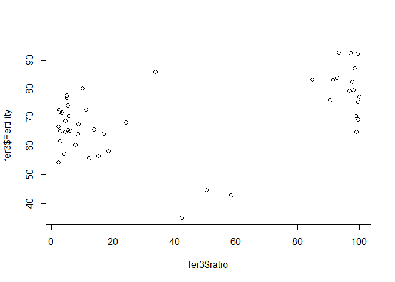
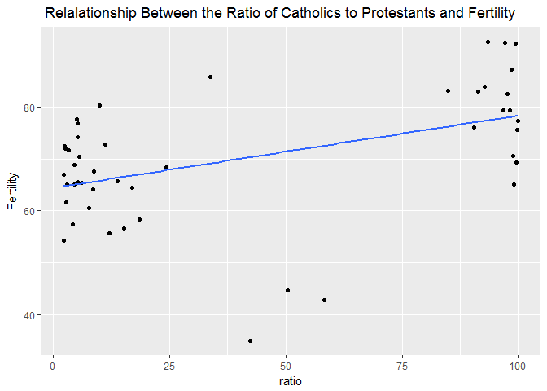
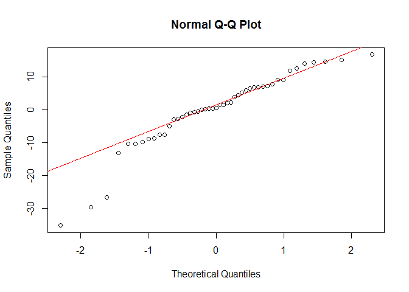
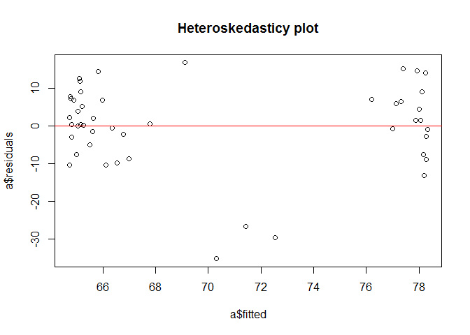
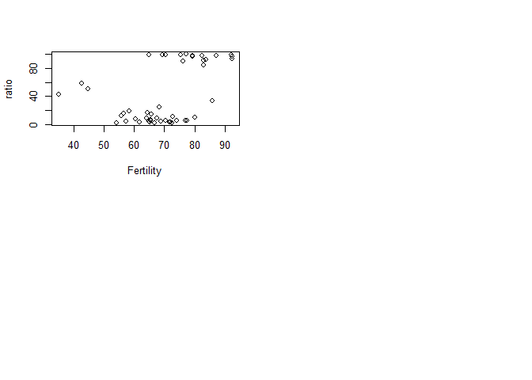
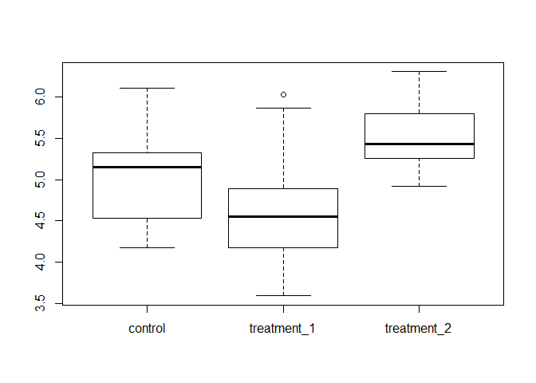
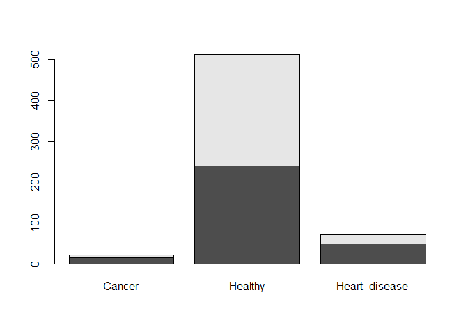
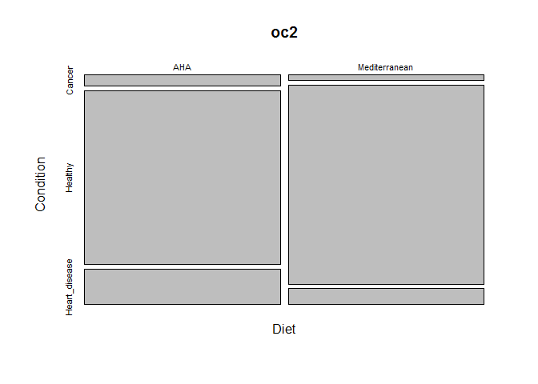

Question 1
==========

    library(stats)
    library(readr)
    library(dplyr)

    ## 
    ## Attaching package: 'dplyr'

    ## The following objects are masked from 'package:stats':
    ## 
    ##     filter, lag

    ## The following objects are masked from 'package:base':
    ## 
    ##     intersect, setdiff, setequal, union

    library(tidyr)
    library(dplyr)

    #Import data set

    pain_intensity <- read_csv("https://dl.dropboxusercontent.com/u/11805474/painblogr/biostats/exam-data-2017/question_1.csv")

    ## Parsed with column specification:
    ## cols(
    ##   `Patient ID` = col_character(),
    ##   `Group and location` = col_character(),
    ##   Sex = col_character(),
    ##   Baseline = col_character(),
    ##   `Week 4` = col_character(),
    ##   `Week 8` = col_character()
    ## )

    pi <- pain_intensity

    print(pi)

    ## # A tibble: 161 × 6
    ##    `Patient ID` `Group and location`    Sex       Baseline       `Week 4`
    ##           <chr>                <chr>  <chr>          <chr>          <chr>
    ## 1          <NA>                NA_NA   <NA> Pain intensity Pain intensity
    ## 2            J1       P_Johannesburg Female              8           9999
    ## 3            J3       T_Johannesburg Female              9           9999
    ## 4            J4       P_Johannesburg Female              5              3
    ## 5            J5       P_Johannesburg Female              7           9999
    ## 6            J6       P_Johannesburg Female              7           9999
    ## 7            J7       T_Johannesburg Female              8              8
    ## 8            J9       T_Johannesburg Female             10              8
    ## 9           J10       T_Johannesburg   Male             10              9
    ## 10          J11       P_Johannesburg Female              9              8
    ## # ... with 151 more rows, and 1 more variables: `Week 8` <chr>

    #1
    #The data given in this question isnt tidy beacuse it is presented in wide format as compared to long format. Furthermore there are values in the table which are out of range and would affect the distribution of the distribution of the data set when performing the respeective statistical tests . As a result all columns which have '9999' should be omited

    #2
    # Tidy data
     
    pi2 <- pi[,-(1:3),drop = FALSE] #Column 1-3 removed for plotting graph

    pi2

    ## # A tibble: 161 × 3
    ##          Baseline       `Week 4`       `Week 8`
    ##             <chr>          <chr>          <chr>
    ## 1  Pain intensity Pain intensity Pain intenisty
    ## 2               8           9999           9999
    ## 3               9           9999           9999
    ## 4               5              3              0
    ## 5               7           9999           9999
    ## 6               7           9999           9999
    ## 7               8              8           9999
    ## 8              10              8              8
    ## 9              10              9              9
    ## 10              9              8             10
    ## # ... with 151 more rows

    pi3 <- pi2[-c(1),] #Row 1 removed
    pi3

    ## # A tibble: 160 × 3
    ##    Baseline `Week 4` `Week 8`
    ##       <chr>    <chr>    <chr>
    ## 1         8     9999     9999
    ## 2         9     9999     9999
    ## 3         5        3        0
    ## 4         7     9999     9999
    ## 5         7     9999     9999
    ## 6         8        8     9999
    ## 7        10        8        8
    ## 8        10        9        9
    ## 9         9        8       10
    ## 10        0     9999        4
    ## # ... with 150 more rows

Question 2
==========

### Null hypothesis:

#### There is no asociation between religion (given as the ratio of Catholics:Protestants) and Fertility .

### Alternative hypothesis:

#### There is an asociation between religion (given as the ratio of Catholics:Protestants) and Fertility .

### Type of data being analysed:

#### The data is continues and is assumed to be normally distributed.

#### We are looking at the association between 2 variables.

### Statistical test

#### Linear Regression Pearson Correlation

### Test assumptions

#### Parametric test, therefore the following assumption need to be met:

#### - The distribution of the data in the population is Gaussian

#### - Equal variance across groups

#### - The errors are independent

#### - Data are unmatched

    library(stats)
    library(readr)
    library(dplyr)
    library(tidyr)
    library(dplyr)
    library(ggplot2)

    #import data set
    fertility <- read_csv("https://dl.dropboxusercontent.com/u/11805474/painblogr/biostats/exam-data-2017/question_2.csv")

    ## Parsed with column specification:
    ## cols(
    ##   State = col_character(),
    ##   Fertility = col_double(),
    ##   Catholic = col_double()
    ## )

    fer <- fertility

    print.data.frame(fer)

    ##           State Fertility Catholic
    ## 1    Courtelary      80.2     9.96
    ## 2      Delemont      83.1    84.84
    ## 3  Franches-Mnt      92.5    93.40
    ## 4       Moutier      85.8    33.77
    ## 5    Neuveville      76.9     5.16
    ## 6    Porrentruy      76.1    90.57
    ## 7         Broye      83.8    92.85
    ## 8         Glane      92.4    97.16
    ## 9       Gruyere      82.4    97.67
    ## 10       Sarine      82.9    91.38
    ## 11      Veveyse      87.1    98.61
    ## 12        Aigle      64.1     8.52
    ## 13      Aubonne      66.9     2.27
    ## 14     Avenches      68.9     4.43
    ## 15     Cossonay      61.7     2.82
    ## 16    Echallens      68.3    24.20
    ## 17     Grandson      71.7     3.30
    ## 18     Lausanne      55.7    12.11
    ## 19    La Vallee      54.3     2.15
    ## 20       Lavaux      65.1     2.84
    ## 21       Morges      65.5     5.23
    ## 22       Moudon      65.0     4.52
    ## 23        Nyone      56.6    15.14
    ## 24         Orbe      57.4     4.20
    ## 25         Oron      72.5     2.40
    ## 26      Payerne      74.2     5.23
    ## 27 Paysd'enhaut      72.0     2.56
    ## 28        Rolle      60.5     7.72
    ## 29        Vevey      58.3    18.46
    ## 30      Yverdon      65.4     6.10
    ## 31      Conthey      75.5    99.71
    ## 32    Entremont      69.3    99.68
    ## 33       Herens      77.3   100.00
    ## 34     Martigwy      70.5    98.96
    ## 35      Monthey      79.4    98.22
    ## 36   St Maurice      65.0    99.06
    ## 37       Sierre      92.2    99.46
    ## 38         Sion      79.3    96.83
    ## 39       Boudry      70.4     5.62
    ## 40 La Chauxdfnd      65.7    13.79
    ## 41     Le Locle      72.7    11.22
    ## 42    Neuchatel      64.4    16.92
    ## 43   Val de Ruz      77.6     4.97
    ## 44 ValdeTravers      67.6     8.65
    ## 45 V. De Geneve      35.0    42.34
    ## 46  Rive Droite      44.7    50.43
    ## 47  Rive Gauche      42.8    58.33

    #Tidying data

    fer2 <- gather(fer, 'religion', 'ratio', Catholic) 
    print.data.frame(fer2)

    ##           State Fertility religion  ratio
    ## 1    Courtelary      80.2 Catholic   9.96
    ## 2      Delemont      83.1 Catholic  84.84
    ## 3  Franches-Mnt      92.5 Catholic  93.40
    ## 4       Moutier      85.8 Catholic  33.77
    ## 5    Neuveville      76.9 Catholic   5.16
    ## 6    Porrentruy      76.1 Catholic  90.57
    ## 7         Broye      83.8 Catholic  92.85
    ## 8         Glane      92.4 Catholic  97.16
    ## 9       Gruyere      82.4 Catholic  97.67
    ## 10       Sarine      82.9 Catholic  91.38
    ## 11      Veveyse      87.1 Catholic  98.61
    ## 12        Aigle      64.1 Catholic   8.52
    ## 13      Aubonne      66.9 Catholic   2.27
    ## 14     Avenches      68.9 Catholic   4.43
    ## 15     Cossonay      61.7 Catholic   2.82
    ## 16    Echallens      68.3 Catholic  24.20
    ## 17     Grandson      71.7 Catholic   3.30
    ## 18     Lausanne      55.7 Catholic  12.11
    ## 19    La Vallee      54.3 Catholic   2.15
    ## 20       Lavaux      65.1 Catholic   2.84
    ## 21       Morges      65.5 Catholic   5.23
    ## 22       Moudon      65.0 Catholic   4.52
    ## 23        Nyone      56.6 Catholic  15.14
    ## 24         Orbe      57.4 Catholic   4.20
    ## 25         Oron      72.5 Catholic   2.40
    ## 26      Payerne      74.2 Catholic   5.23
    ## 27 Paysd'enhaut      72.0 Catholic   2.56
    ## 28        Rolle      60.5 Catholic   7.72
    ## 29        Vevey      58.3 Catholic  18.46
    ## 30      Yverdon      65.4 Catholic   6.10
    ## 31      Conthey      75.5 Catholic  99.71
    ## 32    Entremont      69.3 Catholic  99.68
    ## 33       Herens      77.3 Catholic 100.00
    ## 34     Martigwy      70.5 Catholic  98.96
    ## 35      Monthey      79.4 Catholic  98.22
    ## 36   St Maurice      65.0 Catholic  99.06
    ## 37       Sierre      92.2 Catholic  99.46
    ## 38         Sion      79.3 Catholic  96.83
    ## 39       Boudry      70.4 Catholic   5.62
    ## 40 La Chauxdfnd      65.7 Catholic  13.79
    ## 41     Le Locle      72.7 Catholic  11.22
    ## 42    Neuchatel      64.4 Catholic  16.92
    ## 43   Val de Ruz      77.6 Catholic   4.97
    ## 44 ValdeTravers      67.6 Catholic   8.65
    ## 45 V. De Geneve      35.0 Catholic  42.34
    ## 46  Rive Droite      44.7 Catholic  50.43
    ## 47  Rive Gauche      42.8 Catholic  58.33

    # This is done  as  we are trying to find out the relationship between fertility to that of the ratio of catholics to protestants which is indicated by the column labeled 'ratio'.

    #Exploratory figures and summaries

    summary(fer)

    ##     State             Fertility        Catholic      
    ##  Length:47          Min.   :35.00   Min.   :  2.150  
    ##  Class :character   1st Qu.:64.70   1st Qu.:  5.195  
    ##  Mode  :character   Median :70.40   Median : 15.140  
    ##                     Mean   :70.14   Mean   : 41.144  
    ##                     3rd Qu.:78.45   3rd Qu.: 93.125  
    ##                     Max.   :92.50   Max.   :100.000

    fer3 <- fer2[,-(3), drop = FALSE] #omited column 3 for practicalities sake.
    fer3

    ## # A tibble: 47 × 3
    ##           State Fertility ratio
    ##           <chr>     <dbl> <dbl>
    ## 1    Courtelary      80.2  9.96
    ## 2      Delemont      83.1 84.84
    ## 3  Franches-Mnt      92.5 93.40
    ## 4       Moutier      85.8 33.77
    ## 5    Neuveville      76.9  5.16
    ## 6    Porrentruy      76.1 90.57
    ## 7         Broye      83.8 92.85
    ## 8         Glane      92.4 97.16
    ## 9       Gruyere      82.4 97.67
    ## 10       Sarine      82.9 91.38
    ## # ... with 37 more rows

    plot(fer3$ratio, fer3$Fertility) #scatterplot looking at the association between the two variables.

    #Analysis
    #Since we are looking for a relationship between 2 variables a linear regresion correlation test will be used to test for significance

    ###Test assumptions
    ####Parametric test, therefore the following assumption need to be met:
    ####- The distribution of the data in the    population is Gaussian
    ####- Equal variance across groups
    ####- The errors are independent
    ####- Data are unmatched

    coef(lm(ratio ~ Fertility, data = fer3))# Allows us to get intercepts for abline showing a bositive association

    ## (Intercept)   Fertility 
    ##   -67.44108     1.54806

    fer3a <-fer3[, -(1), drop = FALSE]
    fer3a

    ## # A tibble: 47 × 2
    ##    Fertility ratio
    ##        <dbl> <dbl>
    ## 1       80.2  9.96
    ## 2       83.1 84.84
    ## 3       92.5 93.40
    ## 4       85.8 33.77
    ## 5       76.9  5.16
    ## 6       76.1 90.57
    ## 7       83.8 92.85
    ## 8       92.4 97.16
    ## 9       82.4 97.67
    ## 10      82.9 91.38
    ## # ... with 37 more rows

    fer4<- cor.test(fer3$ratio, fer3$Fertility,
                   method = 'pearson')

    fer4

    ## 
    ##  Pearson's product-moment correlation
    ## 
    ## data:  fer3$ratio and fer3$Fertility
    ## t = 3.5107, df = 45, p-value = 0.001029
    ## alternative hypothesis: true correlation is not equal to 0
    ## 95 percent confidence interval:
    ##  0.2036326 0.6626204
    ## sample estimates:
    ##       cor 
    ## 0.4636847

    a <- lm(fer3a)

    summary(a)# p=0.001 R^2=0.19 r=0.4

    ## 
    ## Call:
    ## lm(formula = fer3a)
    ## 
    ## Residuals:
    ##     Min      1Q  Median      3Q     Max 
    ## -35.309  -4.060   0.511   6.851  16.682 
    ## 
    ## Coefficients:
    ##             Estimate Std. Error t value Pr(>|t|)    
    ## (Intercept) 64.42826    2.30510  27.950  < 2e-16 ***
    ## ratio        0.13889    0.03956   3.511  0.00103 ** 
    ## ---
    ## Signif. codes:  0 '***' 0.001 '**' 0.01 '*' 0.05 '.' 0.1 ' ' 1
    ## 
    ## Residual standard error: 11.19 on 45 degrees of freedom
    ## Multiple R-squared:  0.215,  Adjusted R-squared:  0.1976 
    ## F-statistic: 12.33 on 1 and 45 DF,  p-value: 0.001029

    p <- ggplot(fer3a, aes(ratio, Fertility))+ geom_point() + labs(title = " Relalationship Between the Ratio of Catholics to Protestants and Fertility ")

    p + geom_smooth(method = "lm", se = FALSE)

    #Now we go onto the diagmostic plots for the tests for normal distribution and homoskedasticy.

    qqnorm(a$residuals, main = "Normal Q-Q Plot")  
    qqline(a$residuals, col = "red")

    #According to this diagnostic plot we observe that there is a linear relationship between the resduals which therefore tests the linear regression model for normality.

    plot( x = a$fitted, y = a$residuals, main = 'Heteroskedasticy plot')
    abline(h = 0, col = 'red')

    #The distribution of the data is heteroskedastic.

    par(mfcol = c(2, 2))
    plot(fer3a)

### Conclusion

#### As per the data collected we see that the greater the ratio of Catholics:Protestants the greater the measure of fertility (See scatter plot regresion line). According to the tests performed we see that not all the assumtions are met for a Linear regression model. The data desplays a significantly positive relationship (r = 0.4, p = 0.001029) with very little deviation from the normal(see QQ plot), furthermore heteroskedaticy is observed which tells us that there is an abnormal/uneven distribution within the sample population used. As a reult a linear regression model should not be used despite (Im)test results being in favour of this model.

### \_\_\_\_\_\_\_\_\_\_\_\_\_\_\_\_\_\_\_\_\_\_\_\_\_\_\_\_\_\_\_\_\_\_\_\_\_\_\_\_\_\_\_\_\_\_\_\_\_\_\_\_\_\_\_\_\_\_\_\_\_\_\_\_\_\_\_\_\_\_\_\_\_\_\_\_\_\_\_\_\_\_\_\_\_\_\_\_\_\_\_\_\_\_\_\_\_\_\_\_\_\_\_\_\_\_\_\_\_\_\_\_\_\_\_\_\_\_\_\_\_\_\_\_\_\_\_\_\_\_\_\_\_\_\_\_\_\_\_

Question 3
==========

### Null hypothesis:

#### There is no asociation between crop yeilds and treatment conditions .

### Alternative hypothesis:

#### There is an asociation between crop yeilds and treatment conditions .

### Type of data being analysed:

#### The data is continous and is assumed to be normally distributed.

#### We are looking at 3 measurments (treatments) per individual(crop yeilds)

### Statistical test

#### A one way ANOVA with pairwise post-hoc test will be performed

### Test assumptions

#### Parametric test, therefore the following assumption need to be met:

#### - The distribution of the data in the population is Gaussian

#### - Equal variance across groups

#### - The errors are independent

#### - Data are unmatched

    library(stats)
    library(readr)
    library(dplyr)
    library(tidyr)
    library(dplyr)

    #import data set
    crop_yeilds <- read_csv('https://dl.dropboxusercontent.com/u/11805474/painblogr/biostats/exam-data-2017/question_3.csv')

    ## Parsed with column specification:
    ## cols(
    ##   control = col_double(),
    ##   treatment_1 = col_double(),
    ##   treatment_2 = col_double()
    ## )

    cy <- crop_yeilds

    #Tidying data
    print.data.frame(cy) # Data not tidy

    ##    control treatment_1 treatment_2
    ## 1     4.17        4.81        6.31
    ## 2     5.58        4.17        5.12
    ## 3     5.18        4.41        5.54
    ## 4     6.11        3.59        5.50
    ## 5     4.50        5.87        5.37
    ## 6     4.61        3.83        5.29
    ## 7     5.17        6.03        4.92
    ## 8     4.53        4.89        6.15
    ## 9     5.33        4.32        5.80
    ## 10    5.14        4.69        5.26

    cy1 <- gather(cy, 'Test', 'Value',control:treatment_2) #Data is in long format which will be used for the statistical testing
    print(cy1)

    ## # A tibble: 30 × 2
    ##       Test Value
    ##      <chr> <dbl>
    ## 1  control  4.17
    ## 2  control  5.58
    ## 3  control  5.18
    ## 4  control  6.11
    ## 5  control  4.50
    ## 6  control  4.61
    ## 7  control  5.17
    ## 8  control  4.53
    ## 9  control  5.33
    ## 10 control  5.14
    ## # ... with 20 more rows

    #Exploratory figures and summaries

    summary(cy)

    ##     control       treatment_1     treatment_2   
    ##  Min.   :4.170   Min.   :3.590   Min.   :4.920  
    ##  1st Qu.:4.550   1st Qu.:4.207   1st Qu.:5.268  
    ##  Median :5.155   Median :4.550   Median :5.435  
    ##  Mean   :5.032   Mean   :4.661   Mean   :5.526  
    ##  3rd Qu.:5.293   3rd Qu.:4.870   3rd Qu.:5.735  
    ##  Max.   :6.110   Max.   :6.030   Max.   :6.310

    boxplot(cy)

    #Analysis

    # According to the plot we see that there might be differences between groups
    #Since there are 3 measurements for the same condition as well as the fact that the data is continuous and assumed to be normally distributed we use a 1 way ANOVA to test the Alternative hypothesis.

    #3-ANOVA test which tests for significatnts
    yeild_model=lm(Value~Test, data=cy1)
    anova(yeild_model)

    ## Analysis of Variance Table
    ## 
    ## Response: Value
    ##           Df  Sum Sq Mean Sq F value  Pr(>F)  
    ## Test       2  3.7663  1.8832  4.8461 0.01591 *
    ## Residuals 27 10.4921  0.3886                  
    ## ---
    ## Signif. codes:  0 '***' 0.001 '**' 0.01 '*' 0.05 '.' 0.1 ' ' 1

    summary(yeild_model)

    ## 
    ## Call:
    ## lm(formula = Value ~ Test, data = cy1)
    ## 
    ## Residuals:
    ##     Min      1Q  Median      3Q     Max 
    ## -1.0710 -0.4180 -0.0060  0.2627  1.3690 
    ## 
    ## Coefficients:
    ##                 Estimate Std. Error t value Pr(>|t|)    
    ## (Intercept)       5.0320     0.1971  25.527   <2e-16 ***
    ## Testtreatment_1  -0.3710     0.2788  -1.331   0.1944    
    ## Testtreatment_2   0.4940     0.2788   1.772   0.0877 .  
    ## ---
    ## Signif. codes:  0 '***' 0.001 '**' 0.01 '*' 0.05 '.' 0.1 ' ' 1
    ## 
    ## Residual standard error: 0.6234 on 27 degrees of freedom
    ## Multiple R-squared:  0.2641, Adjusted R-squared:  0.2096 
    ## F-statistic: 4.846 on 2 and 27 DF,  p-value: 0.01591

    #4-Post-hoc test which corrects (x)\ for mutiple comparisons which avoids type 1 and 2 error

    pairwise.t.test(cy1$Value, cy1$Test,#  or  summary(aov(Value~Test, data = cy1))
                    p.adjust.method = 'holm',
                    paired = FALSE)

    ## 
    ##  Pairwise comparisons using t tests with pooled SD 
    ## 
    ## data:  cy1$Value and cy1$Test 
    ## 
    ##             control treatment_1
    ## treatment_1 0.194   -          
    ## treatment_2 0.175   0.013      
    ## 
    ## P value adjustment method: holm

    #Since F = 4.84 and p<0.05 we may accept the Alternative hypothesis and reject the Null hypothesis.

    #Confidence intervals 
    cy1 %>%
        filter(Test == 'treatment_1' | Test == 'treatment_2') %>%
        t.test(Value ~ Test, data = .) %>%
        .$conf.int

    ## [1] -1.4809144 -0.2490856
    ## attr(,"conf.level")
    ## [1] 0.95

    cy1 %>%
        filter(Test == 'control' | Test == 'treatment_1') %>%
        t.test(Value ~ Test, data = .) %>%
        .$conf.int

    ## [1] -0.2875162  1.0295162
    ## attr(,"conf.level")
    ## [1] 0.95

    cy1 %>%
        filter(Test == 'control' | Test == 'treatment_2') %>%
        t.test(Value ~ Test, data = .) %>%
        .$conf.int

    ## [1] -0.98287213 -0.00512787
    ## attr(,"conf.level")
    ## [1] 0.95

### Conclusions

#### According to the ANOVA, treatment\_2 offers the greatest crop yeild where p &lt; 0.05 which is obtained from F-statistics. The Post-Hoc test tells us that only one of the three differences between groups are significant after correcting for errors. The confidence intervals further prove that treatment 2 offers the best yeild when compared to control treatment. The alternative hypothesis is therefore accepted...treatment conditions are associated to crop yeild.

### \_\_\_\_\_\_\_\_\_\_\_\_\_\_\_\_\_\_\_\_\_\_\_\_\_\_\_\_\_\_\_\_\_\_\_\_\_\_\_\_\_\_\_\_\_\_\_\_\_\_\_\_\_\_\_\_\_\_\_\_\_\_\_\_\_\_\_\_\_\_\_\_\_\_\_\_\_\_\_\_\_\_\_\_\_\_\_\_\_\_\_\_\_\_\_\_\_\_\_\_\_\_\_\_\_\_\_\_\_\_\_\_\_\_\_\_\_\_\_\_\_\_\_\_\_\_\_\_\_\_\_\_\_\_\_\_\_\_\_

Question 4
==========

### Null hypothesis:

#### There is no asociation between Diet and Health Condition .

### Alternative hypothesis:

#### There is an asociation between Diet and Health Condition .

### Type of data being analysed:

#### The data is ordinal and as a result non-parametric.

#### We are looking at 2 different groups (AHA and Mediterranean diet)

### Statistical test

#### A Cochran-Mantel-Haenszel test will be performed

### Test assumptions

#### Non-Parametric test, therefore the following assumption need to be met:

#### Observations are independent (unpaired)

#### Observations follow the same distribution

#### Random sampling

    library(stats)
    library(readr)
    library(dplyr)
    library(tidyr)
    library(dplyr)
    library(vcdExtra)

    ## Loading required package: vcd

    ## Loading required package: grid

    ## Loading required package: gnm

    ## 
    ## Attaching package: 'vcdExtra'

    ## The following object is masked from 'package:dplyr':
    ## 
    ##     summarise

    #import data

    outcomes <- read_csv('https://dl.dropboxusercontent.com/u/11805474/painblogr/biostats/exam-data-2017/question_4.csv')

    ## Parsed with column specification:
    ## cols(
    ##   Diet = col_character(),
    ##   Condition = col_character()
    ## )

    oc <- outcomes
    print(oc) # n=605

    ## # A tibble: 605 × 2
    ##     Diet     Condition
    ##    <chr>         <chr>
    ## 1    AHA Heart_disease
    ## 2    AHA Heart_disease
    ## 3    AHA Heart_disease
    ## 4    AHA Heart_disease
    ## 5    AHA Heart_disease
    ## 6    AHA Heart_disease
    ## 7    AHA Heart_disease
    ## 8    AHA Heart_disease
    ## 9    AHA Heart_disease
    ## 10   AHA Heart_disease
    ## # ... with 595 more rows

    #Tidy data

    # Data is in long format so it is tidy however it could however be tabulated to facilitate the analysis.

    head(oc)#-Content of first head  

    ## # A tibble: 6 × 2
    ##    Diet     Condition
    ##   <chr>         <chr>
    ## 1   AHA Heart_disease
    ## 2   AHA Heart_disease
    ## 3   AHA Heart_disease
    ## 4   AHA Heart_disease
    ## 5   AHA Heart_disease
    ## 6   AHA Heart_disease

    tail(oc)#-Content of first tail

    ## # A tibble: 6 × 2
    ##            Diet Condition
    ##           <chr>     <chr>
    ## 1 Mediterranean   Healthy
    ## 2 Mediterranean   Healthy
    ## 3 Mediterranean   Healthy
    ## 4 Mediterranean   Healthy
    ## 5 Mediterranean   Healthy
    ## 6 Mediterranean   Healthy

    oc1 <- group_by(oc, Diet)
    oc1

    ## Source: local data frame [605 x 2]
    ## Groups: Diet [2]
    ## 
    ##     Diet     Condition
    ##    <chr>         <chr>
    ## 1    AHA Heart_disease
    ## 2    AHA Heart_disease
    ## 3    AHA Heart_disease
    ## 4    AHA Heart_disease
    ## 5    AHA Heart_disease
    ## 6    AHA Heart_disease
    ## 7    AHA Heart_disease
    ## 8    AHA Heart_disease
    ## 9    AHA Heart_disease
    ## 10   AHA Heart_disease
    ## # ... with 595 more rows

    oc2 <- xtabs(~Diet + Condition, data = oc1)

    oc2 # Here we see a 3*2 contingency table 

    ##                Condition
    ## Diet            Cancer Healthy Heart_disease
    ##   AHA               15     239            49
    ##   Mediterranean      7     273            22

    #Exploratory figures and summaries

    barplot(oc2)

    mosaicplot(oc2)

    #Analysis
    ###

    #The data being analysed is ordinal

    #As a result the followibng assumptions should be met:
    # - Observations are independent (unpaired)
    # - Observations follow the same distribution
    # - Random sampling

    # A Cochran-Mantel-Haenszel test will be performed to test the Alternative Hypothesis

    CMHtest(oc2, types = c("cmeans"))

    ## Cochran-Mantel-Haenszel Statistics for Diet by Condition 
    ## 
    ##                 AltHypothesis  Chisq Df       Prob
    ## cmeans Col mean scores differ 15.407  2 0.00045116

    # From the CMH statistical test p<0.001 and X^2 = 15.4

### Conclusions:

#### According to the statistical test performed the Alternative hypothesis is confirmed because it has been shown that p&lt;0.05 and X^2 = 15.4. \#\#\#\#Clearly Diet has an effect on health with the Mediterranean diet being significantly healthy.
